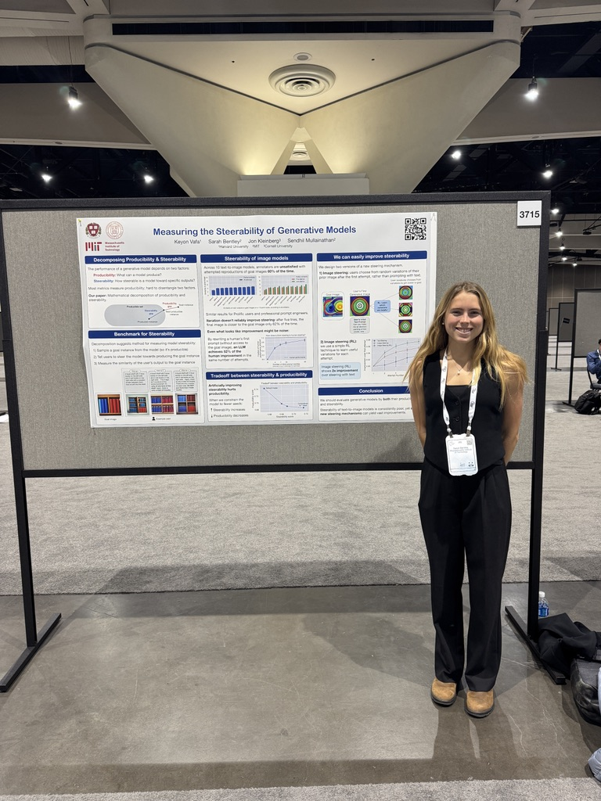

# About Me
I'm Sarah Bentley, a first year PhD student here at MIT. My research is focused on applying concepts in theoretical computer science to build human + machine learning systems that discover new algorithms. [Here is a link to my real website](https://sarahbentley.github.io/sarahbentley/) and below is a picture of me presenting a poster recently!

# Table of Contents
[Link to Assignment 1](assignments/assignment1.md)
