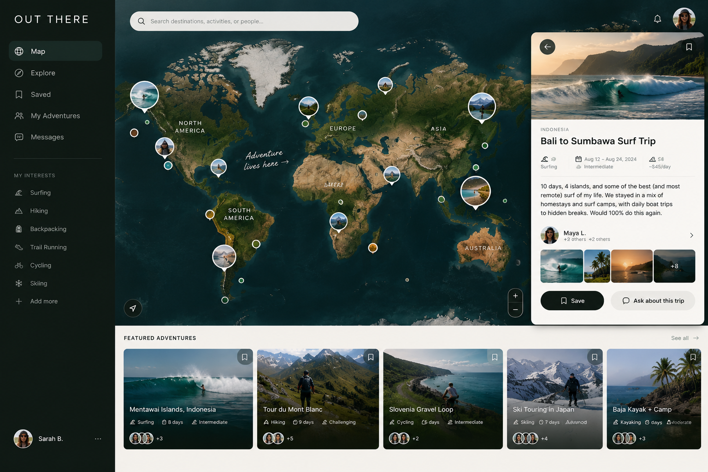

# Exercise 1: Problem Framing

## Personal Goals

I want to learn how to design software that works well with people. As mentioned in class, as AI advances, the barriers to building software further and further decrease. I find this both exciting and overwhelming. While it's excellent to have these tools at my disposal, I feel like I don't know the first thing about the higher level of abstraction: Creating usable software. On the development side, I want to learn how to code effectively with AI. How do I leverage coding agents while still writing code that's modular, easy to understand, bug-free, and easy to change? What are the qualities of well-designed software, from the perspective of the developer? On the user side, I want to learn how to make software that's realistically useful to people, rather than only being useful in theory. I find myself often incorrectly predicting the needs and actions of users, and thus designing bad software. I want to learn how to cater to users.

I'm also excited by the prospect of designing AI-powered software that's made to work with people. I believe AI development is currently operating under an automation mindset, designing AI tools to replicate or exceed human capabilities. While this mindset has led to the emergence of incredible AI capabilities, it's not catered to the user's experience. Software engineers are left caught between authoring their own code and using coding agents to generate massive amounts of (potentially buggy) code they can't easily verify. Students struggle to balance using AI to improve their understanding and letting AI do all their homework for them. When people are writing, they can't help but let an AI agent turn their messy list of ideas into seemingly clear prose, turning down the opportunity to use writing as a tool for thinking more deeply. These seem more like design problems than a lack of AI capability. I want to design software that uses AI to boost, rather than replace, human thinking. I hope this class will help me learn how to do so.

## Problem Statement

### Domain
Many people, myself included, love doing *athletic travel adventures*. These trips are centered around doing physically demanding outdoor activities, such as biking, trekking, camping, surfing, trail running, or skiing, in beautiful places. Athletic travel adventures are different in nature from sightseeing or relaxing vacations, as travelers center their trips around their activities and often choose very remote destinations. This makes planning very complex. Travelers have to find very niche information on weather conditions, gear, routes, transportation, lodging, and the difficulty level of their activity. For example, to plan a surf trip, one must find a surf spot that is suited to their ability, ensure the conditions will be good, figure out how to rent or transport a surfboard, and then plan the standard parts of the trip, such as where they'll stay and how to get there. Travelers often ascertain this information through internet searches, Reddit, word-of-mouth, social media, blogs, YouTube videos, and mapping applications. Furthermore, travelers often want to find companions whose interests, athletic abilities, schedules, and expectations are compatible with their own. Stakeholders in this domain are people actively planning an athletic adventure, passively looking for inspiration, or looking for travel companions.

### Bad Situations
There are two main types of bad situations in this domain.

The first type of bad situation occurs when travelers are trying to plan an athletic adventure but cannot easily find the information needed to do so effectively. For example, two summers ago I spent extensive time and energy planning a surf trip in Indonesia. I had specific criteria. I wanted to go somewhere with waves that were suited to my ability and not too crowded. As a female traveling alone, I wanted to feel safe. I wanted to explore a remote location without being too far from good hospitals. Finally, I wanted to visit at least two different islands. The information I needed to plan according to these criteria was not easily accessible. I had to look deep amongst Reddit threads, watch lots of YouTube videos, look at blogs, and contact people at hostels. Desperate for advice, I reached out to a distant acquaintance. It took a lot of work to finally settle on a travel itinerary, and even then, I faced a lot of uncertainty and lacked important information. For example, I didn't bring the proper first-aid equipment. Before committing to traveling across the world, I needed advice, but struggled to find some.

Another bad situation occurs when a traveler really wants to do an athletic adventure but doesn't have anyone to do it with. Many athletic adventures are safer and more fun with a friend. Someone who wants to spend several days surfing, backpacking, trail running, or cycling may have friends who are interested in traveling but not the same activity, difficulty level, pace, or style of traveler. As a result, the traveler may have to change the trip, or go alone.

### Corroboration

In planning surfing, biking, and trekking trips, my friends and I have consistently struggled, searching far and wide for the information we need. Additionally, I have often struggled to find friends to join me on surf trips, as I have only one friend with the same surfing ability.

More generally, travelers often resort to platforms like Reddit, YouTube, and blogs to plan athletic adventures. I've linked many examples below. The extensive use of these platforms for trip planning, despite their being incomplete and decentralized, demonstrates the challenge of planning athletic adventures. In fact, companies such as [Backroads](https://www.backroads.com/) have gained popularity largely because they organize athletic adventures for their customers, although at a high cost.

The ubiquity of outdoor recreation platforms also demonstrates the demand for reliable information on athletic adventures. For example, on [AllTrails](https://www.alltrails.com/) users publish routes and contribute reviews, photos, and other information about their experiences. On [Strava](https://www.strava.com/), users share running and biking routes. However, these platforms are tailored to one-day excursions, rather than entire trips, lacking long routes and details like lodging and equipment.

The challenge of planning trips is even greater for those who are not already connected to an athletic community. Travel information is often spread by word-of-mouth within athletic communities. Therefore, people who are new to an activity not only lack travel companions, but also lack an important source of information. I have experienced this challenge. Almost all of my successful surf trips have arisen from recommendations from other surfers. When my family has researched trips on our own, we've encountered unexpected conditions, such as waves being too small or too big, that prevented us from being able to surf to our liking.

### Workarounds

Travelers currently have to move between several platforms to gather travel inspiration, first-person experience, activity information, trip logistics, and social connection. As described above, many travelers resort to social media platforms like Reddit, YouTube, blogs, Strava, or AllTrails and word-of-mouth to plan athletic adventures (examples linked below). The information from social media is not only decentralized but also patchy, opinionated, and quite unreliable. It often lacks the type of personalized information needed for athletic travel. Furthermore, travel routes on Strava and AllTrails are primarily for one-day excursions, and lack information on travel details like lodging and equipment. It's best to get travel recommendations from friends, who are reliable sources. However, travelers may not have friends with the same hobby and ability level.

### Solution Sketch

Shown above is an AI-generated mockup of my proposed solution (credit: ChatGPT).

I propose a social platform for athletic adventures. On this platform, users can share their adventures, connect with like-minded adventurers, and share travel advice. When a user goes on a trip, they post a travel journal with images, text, and perhaps videos. Their feed is a map of the world, with pinpoints for their friends' adventures. Users can browse this feed for inspiration, saving other users' trips for the future. Overall, this platform will have the following primary courses of action: friending, posting an adventure, saving an adventure to your profile, and messaging.

I will intentionally design the platform to avoid the following potential issues:

1. *Issue:* Adventure travelers are hesitant to share information, for fear of their routes getting over-crowded.

   1. *Design:* All profiles will be kept private by default. Users will only see adventures posted by their friends. So, more information will certainly be shared, but it won't be publicly accessible.
2. *Issue:* Travelers don't want to be burdened with providing extensive information about their adventures in posts.

   1. *Design:* Users can upload content as a free-form journal, with text, images, and photos, like a small blog.

The goal is not to replace existing platforms like Reddit, YouTube, AllTrails, or Strava. Rather, I want to connect functions these platforms all separately have: discovering adventures, understanding what they are actually like from reliable sources, and finding people to travel with.

## References

**Reddit Threads:**

* [A month in indo](https://www.reddit.com/r/surfing/comments/1l0z7jg/a_month_in_indo/)
* [help me with indo trip](https://www.reddit.com/r/surfing/comments/1k5hutk/help_me_with_indo_trip/)
* [Surfing Indonesia in January](https://www.reddit.com/r/surfing/comments/1lb2ga1/surfing_indonesia_in_january/)
* [Ultimate Indonesia Surf Trip](https://www.reddit.com/r/surfing/comments/17xo9pr/ultimate_indonesia_surf_trip/)
* [Dolomites route planning](https://www.reddit.com/r/hiking/comments/1gfhi8k/dolomites_route_planning_huttohut_how_to_plan_and/)
* [Best Area/Routes for trekking in the Dolomites requested](https://www.reddit.com/r/hiking/comments/1mxggpq/best_arearoutes_for_trekking_in_the_dolomites/)
* [Cycling in Slovenia](https://www.reddit.com/r/bicycletouring/comments/1qi1orv/cycling_in_slovenia/)

**Travel guide blogs and YouTube videos:**

* [Indonesia Surf Guide](https://www.perfectwavetravel.com/indonesia-surf-guide/)
* [Surfing Indonesia (YouTube video)](https://www.youtube.com/watch?v=kUeo9tnPU_k)
* [The INTERMEDIATE Surf Guide to Indonesia...](https://www.youtube.com/watch?v=lmhrrJzQ-IA)
* [Hiking the Dolomites in Italy: A Guide’s Love Letter to the Mountains](https://57hours.com/review/hiking-dolomites-italy/)
* [Demystifying The Dolomites: The 2026 Planning Guide For Your First Trip](https://whereandwander.com/demystifying-the-dolomites-how-i-planned-my-first-road-dolomites/)

**Paid athletic adventure services:**

* [Slovenia Bike Tour](https://www.vbt.com/destinations/europe/slovenia/slovenia-bike-tour-through-alpine-valleys)
* [Another Slovenia bike tour](https://trektravel.com/tour/cycling/slovenia/)
* [Backroads](https://www.backroads.com/)
